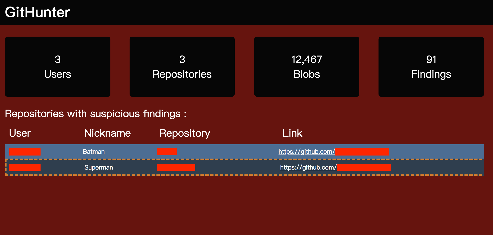
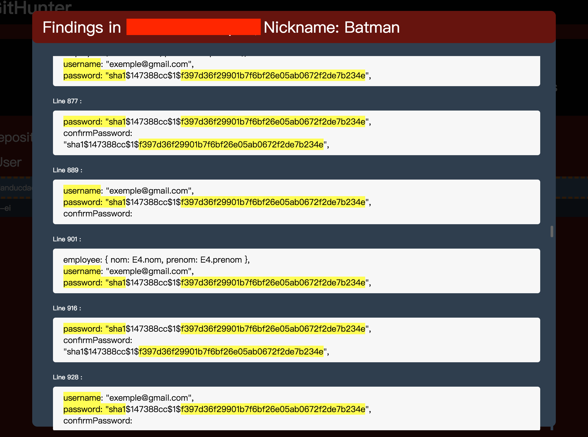
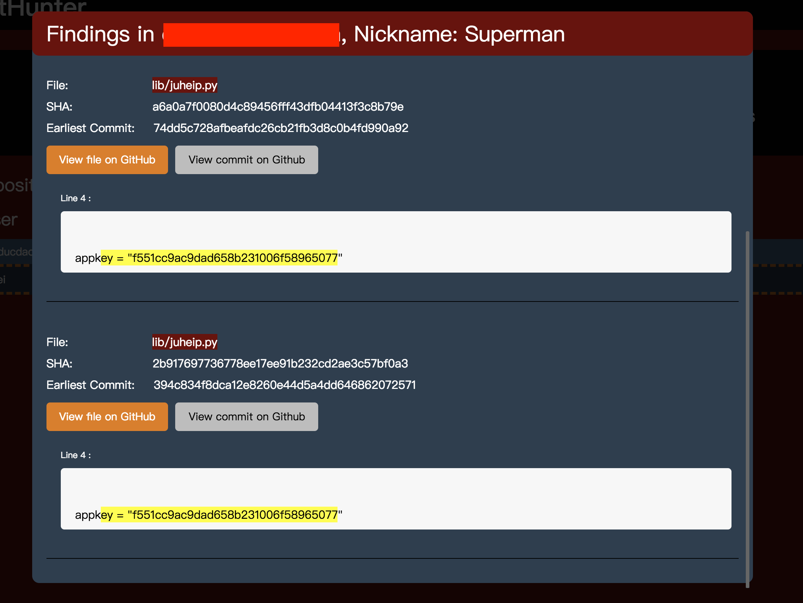

# Git-Hunter

GitHub 监控扫描器，扫描 Git 仓库中的密码泄漏或敏感词。

## 介绍

很多公司和机构都发生过类似的安全事件：员工不小心将密钥和敏感信息写入了代码，并上传到了 Github 上。此工具就是为这样的场景准备的。Git-Hunter 是一个自动监控系统，它深入 Git 的提交历史挖掘潜在的泄漏信息，并用漂亮易读的报告将其展示出来。



## 安装

首先，你需要安装 [Ruby](https://www.ruby-lang.org/en/documentation/installation/).

在安装完成 Ruby 之后，安装 bundle:

```shell
$ gem install bundle
```

然后通过 bundle 安装所需要的 gem:

```shell
$ cd /path/to/git_hunter &&  bundle install
```


## 使用说明

Git-Hunter 主要功能: 

#### 0. 扫描单个远程/本地仓库

尽管 Git-Hunter 是为了 Github 监控而定制的，但是很多用户只是希望临时的扫描单个本地/远程的仓库而已。没问题，Git-Hunter 提供了这样的功能。 不过首先，请阅读其他章节中的配置部分，确保你将感兴趣的关键词 `SENSITIVE_WORDS` 设定完毕。

对于单个本地的仓库，你可以:

```shell
    $ ruby ./git_hunter.rb run local /path/to/local/git/repo
```

对于单个远程仓库中，你可以(需要确保你有权限拉取该远程仓库):

```shell
    $ ruby ./git_hunter.rb run custom_link https://gitlab.com/some/repo
```

等待扫描完毕，相关的报告将会在 `report` 文件夹下生成。


#### 1. 监控指定的 Github 用户

首先:

```shell
$ cp user_list.txt.example user_list.txt
$ cp config.rb.example config.rb
$ vim user_list.txt
```

然后添加一些你想要监控的 GitHub 用户，每行一个:

```shell
# user_list.txt
Interfish superman # 第一行为 GitHub 的用户名，第二行为该用户的别名（可选参数）
https://github.com/rails batman # 第一行也可以是该用户的 github 的链接
octocat # 没有别名？完全没问题
```

什么是别名？很多时候，你都需要将员工在公司中的名字和 github 用户名对应起来。为了使审阅报告更加方便，你可以给某个人设置别名。没有别名也没有关系，只要留空就好了。

接下来需要设定一些参数。**Git-Hunter 会试图在仓库中寻找两样东西 - 敏感词和泄漏密钥。** 他们都在 `config.rb` 中设置。

泄漏密钥的配置在 `KEY_WORDS` 中，对于大多数用户来讲，初始的设定已经够用了，所以一般没有必要变更。

敏感词的设定则大为不同。假设你是 Google 的员工，你们公司中的一些项目被命名为了 'abc'、'def' 以及 'ghi'，并且公司的一些内部域名为 'dada.com' 以及 'pope.com'。这时候，你可以添加以下设置:

```ruby
# config.rb
SENSITIVE_WORDS = %w{
	google
	abc
	def
	ghi
	dada.com
	pope.com
}
```

Git-Hunter 会使用正则表达式来匹配这些关键词。因此，尝试想一些非常有代表性的、你非常关心的敏感词，这会直接影响到搜索的结果。

最后一件事，别忘了设置 [Github personal access token](https://github.com/settings/tokens):

```ruby
# config.rb
GITHUB_OAUTH_TOKEN = 'your github access token'.freeze
```

好了！准备开始扫描，执行:

```shell
$ ruby ./git_hunter.rb run
```

Git-Hunter 会自动的拉取 user_list.txt 中所有用户的仓库并分析。结束之后会生成一份 HTML 报告，并高亮潜在的泄漏点。

如果你只想扫描单个用户:

```shell
$ ruby ./git_hunter.rb run user Interfish [别名]
or
$ ruby ./git_hunter.rn run user https://github.com/Interfish [别名]
# nickname is optional
```

单个 GitHub 仓库:

```shell
$ ruby ./git_hunter.rb run repo Interfish git-hunter [别名]
or
$ ruby ./git_hunter.rb run repo https://github.com/Interfish/git-hunter [别名]
# nickname is optional
```


#### 2. Keep findings and ignore false positive

All findings are stored in a local SQLite database. Of course, there are lots of 'false positive'. So CLI provide ways to mark them as false positive and they will not show up in your next generated HTML report.

For example, if you have already watched the HTML report of https://github.com/Interfish/git-hunter and you are very sure it does not contain sensitive words and possible key leaks, you can:

```shell
$ ruby ./git_hunter.rb mark repo Interfish git-hunter
```

Or, if you are sure all findings of Interfish are false positive:

```shell
$ ruby ./git_hunter.rb mark user Interfish
```

more, if all findings in DB are false positive:

```shell
$ ruby ./git_hunter.rn mark all
```

#### 3.Generate report

You can manually generate HTML report. It will fetch in-DB findings which has not been marked as false positive. All report will located in dir `reports`.

Generate for a single repo:

```shell
$ ruby ./git_hunter.rb report repo Interfish git_hunter
```

For a single user

```shell
$ ruby ./git_hunter.rb report user Interfish
```

For all findings in DB:

```shell
$ ruby ./git_hunter.rb report all
```

#### 4. Global search across the whole Github

You can't always include all users in your list. Usually some out-of-list users will do bad things, e.g. new employee who haven't submit their github url, your opponent, dark industry. Global search becomes extremly useful at this time.

First, configure `config.rb`:

```ruby
# config.rb
GLOBAL_SENSITIVE_WORD = %w{
	google
	abc
	def
	ghi
	dada.com
    pope.com
}
```

And then run:

```shell
$ ruby ./git_hunter.rb run global
```

Git-Hunter will search those global sensitive words across the whole Github using [Github API](https://developer.github.com/v3/) , and the result is the same as [Github commit search](https://github.com/search?q=google&type=Commits). You will get a HTML report once  finished.

Make sure all findings are harmless. Then you could mark them all as false positive:

```shell
$ ruby ./git_hunter.rb mark global
```


#### 5. NOTE!!!

`SENSITIVE_WORDS` and  `GLOBAL_SENSITIVE_WORD` vary a lot with different users come from different organization. **Try to use some highly representitive words and avoid common words.** For example, you should avoid words like 'google', 'apple' or 'banana' cause there are miliions of commits related to those words and you can get nothing from them. **Here's a principle of drafting proper sensitive words: once they appear in a repo, it's very likely that this repo leaks something from your comapny/organization.**


#### 6. Screenshot






## Machanism breif explanation

Git-Hunter dig depply into low-level Git system. It will iterate all branches in a repo and analyse/store base on blob. In DB, there are several tables:

```shell
  users - represent Github users
  repos - represent Github repos, belong to some user
  blobs - represent each blob in a repo, belong to a repo
  findings - represent findings in blobs, belong to a blob
  global_findings - represent global findings
  global_finding_words - record each global sensitive word count appears on Github. 
  
```
So for a normal run. You don't have to worry about user add/delete something in their repo. **Git-Hunter will use hash value on each blob to compare, and automatically async new changes.** All files in history will be included in search, no file will be missed. `sensitive_word` use regular expression to match words. `key_words` use combination of password-like pattern and string entrophy to find possible key-leaks.

For a global run, I found it hard to track what's new and what's old on Github cause there are too many. So I did a little trick - focusing on the total amount of the search result which is provided by github index engine. 

## Advanced Configuration

You may have noticed there's dozens of configuration in `config.rb`. To maximize the performance, here's explanation:

* GITHUB_OAUTH_TOKEN - [your Github personal access token](https://github.com/settings/tokens)
* SKIPPABLE_FILE_SIZE - skip if file size is larger than this. In bytes.
* SKIPPABLE_REPO - some repo name like 'GitHub.io', you may want to skip.
* SKIPPABLE_DIR - some dir like 'node_modules' you may want to skip.
* LINES_EACH_BLOCK - used for key-leaks detecting. usually 3 - 5 is okay.
* SHANNON_ENTROPHY_THRESHOLD - If word count in a string is larger than this, Git-Hunter will treate it as a potential password and calculate it's shannon entrophy.
* MIN_BLOCK_LEN_SKIPPABLE - if length of a code block is larger than this, skip it.
* SENSITIVE_WORDS - use them as regular expression to match in code.
* KEY_WORDS - password-like pattern.
* SUSPECTIBLE_FILE_PATTERN - if filename match one of them, it may be a leaked file.
* GLOBAL_ADDITION_MAX_SIZE - fetch some new indexed commits on each sensitive word when run global, but no more than this size.
* GlOBAL_FINDING_MAX_SIZE - restrict how much global finding you can store in DB.
* GLOBAL_SENSITIVE_WORDS - used to find related commits through Github search. 


## Advanced Managing DB

Git-Hunter use ActiveRecord to reflect DB. So, if you know how to use Ruby, you can:

```shell
$ irb -r ./git_hunter/git_hunter_base.rb
```

to open a interactive Ruby Shell, and then:

```ruby
GitHunterCore.new # establish connection
# then do whatever you want, like query a specific finding
finding = Finding.where(id: 2).first
finding.update(is_valid: false) # mark this finding as false positive
...
```
